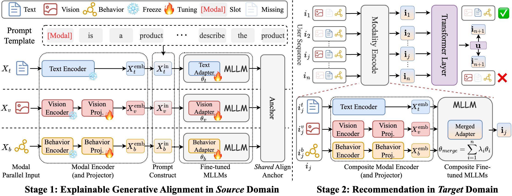

# EARec
The official implementation for *Explainable Multi-Modality Alignment for
Transferable Recommendation*. [paper](blob/The_WebConf_2025_.pdf)

> Shenghao Yang, Weizhi Ma, Zhiqiang Guo, Min Zhang, Haiyang Wu, Junjie Zhai, Chunhui Zhang, Yuekui Yang. Explainable Multi-Modality Alignment for Transferable Recommendation. TheWebConf 2024.


<div align=center>

</div>

## Quick Start

To repreduce our experiment results of ```Office``` dataset, you should follow the steps below:

1.Git clone this repository.
``` bash
git clone https://github.com/ysh-1998/EARec.git
```
We provide a preprocessed dataset of ```Office``` dataset in ```dataset/Office```. The images of ```Office``` dataet should be download from [Google Drive](https://drive.google.com/file/d/1r2-s-iXU97-MuUdETM-t5m_R88064u5J/view?usp=drive_link) and place in ```dataset/Office/image```. 

2.Install the required packages. The enviorment is built following LLaVA, please refer to the [installation](https://github.com/haotian-liu/LLaVA?tab=readme-ov-file#install) steps of LLaVA.

3.Download the finetuned LoRA weights of three modalities from [Google Drive](https://drive.google.com/file/d/13ybxzRQwVa99TkGfEaS4sqijAz02-EzJ/view?usp=drive_link) and place them in ```checkpoints```. To reproduce the alignment training process, you can refer to the scripts in ```scripts/v1_5```.

4.Merge the LoRA weights of three modalities.
``` bash
bash scripts/v1_5/merge_lora.sh
```
5.Get the multi-modal item embedding with EARec.
``` bash
bash scripts/v1_5/eval/eval_emb.sh
``` 
You can also get the multi-modal item embedding with mulitple GPUs using following command.
``` bash
CUDA_VISIBLE_DEVICES=0,1,2,3 bash scripts/v1_5/eval/eval_emb_dp.sh
```
6.Perform downstream recommendation model with aligned multi-modal item embedding. 

We implement downstream recommendation beased on [RecBole](https://github.com/RUCAIBox/RecBole) libary, run the following command to built a new enviorment for recommendation experiments.
``` bash
conda create -n rec python==3.9
conda activate rec
pip install recbole==1.0.1
```
Then run the following command.
``` bash
python downstream/finetune.py --gpu_id=0 -d Office --plm_suffix="featEARec.tvb"
```